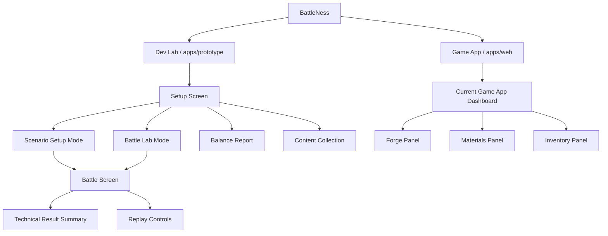
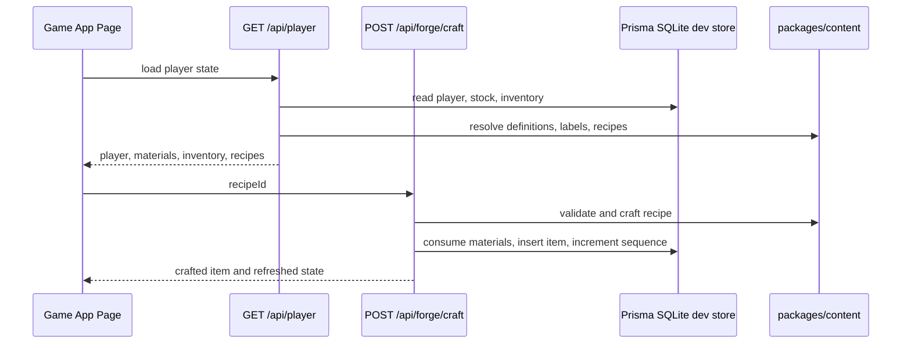
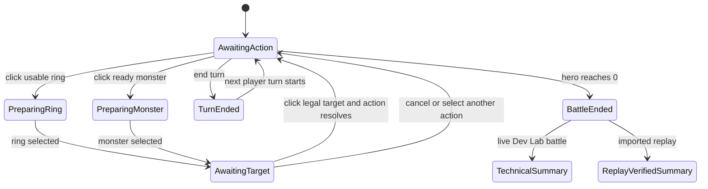

# UI Wireframes

This document describes technical, non-visual wireframes for the BattleNess views that exist today or are directly implied by the current implementation.

## Legend

- `[Panel]`: bounded functional area.
- `{Control}`: user input, button, select, or action.
- `(State)`: displayed state derived from engine, content, local storage, or database.
- `->`: primary flow or navigation.
- `Dev Lab`: implemented in `apps/prototype`.
- `Game App`: implemented in `apps/web`.
- `Proposed`: not implemented yet, but a likely structural target.

## Surface Map



## Proposed Game App Shell / Main Menu

Status: proposed. A full main menu is not implemented yet. The current `apps/web` page is a first dashboard combining player summary, forge, materials, and inventory.

Purpose: provide the future player-facing entry point while preserving `apps/prototype` as the Dev Lab.

```text
+--------------------------------------------------------------------------------+
| [Brand] BattleNess                                      [Player] [Credits] [XP] |
+--------------------------------------------------------------------------------+
| {Battle} {Campaign} {Forge} {Inventory} {Shop} {Profile} {Settings}            |
+--------------------------------------------------------------------------------+
| [Primary Route Outlet]                                                          |
|                                                                                |
|   Selected route content:                                                       |
|   - Battle: mode selection, active loadout, start flow                          |
|   - Campaign: map/opponent selection, locked/unlocked progression              |
|   - Forge: recipes, crafting, improvement                                      |
|   - Inventory: owned items, socketing, enchantments, equipment                 |
|   - Shop: buy/sell materials and items                                         |
|   - Profile: account, level, progression, match history                        |
|                                                                                |
+--------------------------------------------------------------------------------+
| [Optional Status Bar] server status / build version / localization              |
+--------------------------------------------------------------------------------+
```

Technical notes:

- The shell should own navigation, authentication state, player summary, and localization.
- Each route should fetch through server APIs rather than reading content directly in the browser when persistence is involved.
- The Dev Lab should stay accessible separately and should not be hidden behind this player-facing shell.

## Game App Dashboard

Status: implemented in `apps/web/app/pages/index.vue`.

Purpose: first player-facing infrastructure screen backed by the local Prisma SQLite development store.

```text
+--------------------------------------------------------------------------------+
| [Brand Logo]                                                                    |
| Game App                                                                        |
| Persistent inventory and forge scaffold.             [Player Summary Panel]     |
|                                                       - username                |
|                                                       - experience              |
|                                                       - credits                 |
+--------------------------------------------------------------------------------+
| [Left Column]                                      | [Right Column]             |
|                                                   |                            |
| [Forge Panel]                                    | [Inventory Panel]           |
| - {Recipe Select}                                | - empty state OR            |
| - {Craft Button}                                 | - item cards                |
| - selected output card                           |   - name                    |
|   - rarity                                       |   - type                    |
|   - element/type/level/quality                   |   - quality                 |
|   - ingredient availability                      |   - XP                      |
| - feedback after craft                           |   - sockets when ring       |
|                                                   |   - technical instance ID   |
| [Materials Panel]                                |                            |
| - material cards                                 |                            |
|   - name                                         |                            |
|   - rarity                                       |                            |
|   - symbol or material type                      |                            |
|   - crafting family                              |                            |
|   - quantity                                     |                            |
+--------------------------------------------------------------------------------+
```

Primary data flow:



## Dev Lab Setup Screen

Status: implemented in `apps/prototype`.

Purpose: technical launcher and diagnostics hub for deterministic scenarios, Battle Lab, simulations, collection, and balance checks.

```text
+--------------------------------------------------------------------------------+
| [Brand Header] BattleNess                                                       |
+--------------------------------------------------------------------------------+
| [Setup Controls]                                                                |
| - {Mode Select: Scenario | Battle Lab}                                          |
| - if Scenario: {Scenario Select}                                                |
+--------------------------------------------------------------------------------+
| [Setup Summary]                                                                 |
| - battle id / scenario description / players / seed                             |
| - player setup preview                                                          |
|   - hero stats                                                                  |
|   - rings                                                                       |
|   - gems                                                                        |
|   - enchantments                                                                |
| - {Start Battle}                                                                |
+--------------------------------------------------------------------------------+
| [Development Panels]                                                            |
| - Battle Lab Editor                                                             |
| - Content Balance Report                                                        |
| - Content Collection                                                            |
+--------------------------------------------------------------------------------+
```

## Dev Lab Scenario Setup Mode

Status: implemented in `apps/prototype`.

Purpose: select deterministic scenario fixtures and preview resolved setup before combat.

```text
+--------------------------------------------------------------------------------+
| [Scenario Picker]                                                               |
| {Scenario Select} -> selected scenario                                          |
+--------------------------------------------------------------------------------+
| [Scenario Metadata]                                                             |
| - battle setup id                                                               |
| - description                                                                   |
| - player ids                                                                    |
| - seed                                                                          |
+--------------------------------------------------------------------------------+
| [Player One Preview]                         [Player Two Preview]              |
| - level / health / speed                     - level / health / speed           |
| - equipped rings                             - equipped rings                   |
| - ring damage / energy / cooldown            - ring damage / energy / cooldown  |
| - socketed gems                              - socketed gems                    |
| - spell or monster enchantments              - spell or monster enchantments    |
+--------------------------------------------------------------------------------+
| {Start Battle}                                                                  |
+--------------------------------------------------------------------------------+
```

## Dev Lab Battle Lab Editor

Status: implemented in `apps/prototype`.

Purpose: editable two-player battle-scoped configuration for testing engine behavior and balance without player inventory state.

```text
+--------------------------------------------------------------------------------+
| [Battle Lab Toolbar]                                                            |
| - {Preset Name} {Save} {Load} {Delete}                                          |
| - {Export JSON} {Import JSON}                                                   |
| - {Run Batch Simulation}                                                        |
+--------------------------------------------------------------------------------+
| [Comparison / Balance Metrics]                                                  |
| - player health                                                                 |
| - speed                                                                         |
| - total ring damage                                                             |
| - total energy cost                                                             |
| - damage per energy                                                             |
| - damage per cooldown                                                           |
| - warnings                                                                      |
+--------------------------------------------------------------------------------+
| [Player One Editor]                         [Player Two Editor]                |
| - player id / username / level              - player id / username / level      |
| - ring rows                                - ring rows                         |
|   - direct definition                        - direct definition                |
|   - level / quality                          - level / quality                 |
|   - socket count: 1 to 3                     - socket count: 1 to 3            |
|   - gem rows                                 - gem rows                        |
|     - direct definition                      - direct definition              |
|     - level / quality                        - level / quality                 |
|     - direct spell or monster enchantment    - direct spell or monster enchantment |
+--------------------------------------------------------------------------------+
| [Simulation Results]                                                            |
| - deterministic variants                                                        |
| - starting player                                                               |
| - result                                                                        |
| - actions / turns                                                               |
| - final health                                                                  |
+--------------------------------------------------------------------------------+
```

## Dev Lab Content Balance Report

Status: implemented in `apps/prototype`.

Purpose: inspect content balance across progression profiles and identify high primary-metric outliers.

```text
+--------------------------------------------------------------------------------+
| [Balance Summary]                                                               |
| - profile: base / mid / max                                                     |
| - item categories                                                               |
+--------------------------------------------------------------------------------+
| [Warnings]                                                                      |
| - high primary metric outliers                                                  |
| - grouped by type and rarity                                                    |
+--------------------------------------------------------------------------------+
| [Item Groups]                                                                   |
| [Rings] [Gems] [Monsters] [Spells]                                              |
| - definition id                                                                 |
| - rarity / element                                                              |
| - base, mid, max values                                                         |
| - primary metric                                                                |
+--------------------------------------------------------------------------------+
```

## Dev Lab Content Collection

Status: implemented in `apps/prototype`.

Purpose: technical asset/content coverage view for all current definitions.

```text
+--------------------------------------------------------------------------------+
| [Collection Container]                                                          |
| - collapsible item groups                                                       |
+--------------------------------------------------------------------------------+
| [Rings]                                                                         |
| - definition cards with asset crop, id, rarity, element                         |
+--------------------------------------------------------------------------------+
| [Gems]                                                                          |
| - definition cards with asset crop, id, rarity, element                         |
+--------------------------------------------------------------------------------+
| [Monsters]                                                                      |
| - definition cards with asset crop, id, rarity, element, skill when present     |
+--------------------------------------------------------------------------------+
| [Spells]                                                                        |
| - definition cards with asset crop, id, rarity, element                         |
+--------------------------------------------------------------------------------+
| [Materials]                                                                     |
| - definition cards with asset crop, id, rarity, crafting family                 |
+--------------------------------------------------------------------------------+
```

## Dev Lab Battle Screen

Status: implemented in `apps/prototype`.

Purpose: technical combat interface with a board-like view plus detailed manual controls and logs.

```text
+--------------------------------------------------------------------------------+
| [Top Energy Track: opposing or top-side player]                                 |
+--------------------------------------------------------------------------------+
| [Top Ring Belt - visible for development testing]                               |
| - ring cards: element, artwork, damage, energy, cooldown, sockets               |
+--------------------------------------------------------------------------------+
| [Board Action Hint]                                                             |
| - selected action or next required step                                         |
+--------------------------------------------------------------------------------+
| [Battle Board]                                                                  |
| [Top Hero]           [Top Monster Slots: 3]                                     |
| - health            - each slot: empty OR monster card                          |
|                      - skill, element, damage, health, cooldown                 |
|                                                                                |
| [Bottom Hero]        [Bottom Monster Slots: 3]                                  |
| - health            - each slot: empty OR monster card                          |
|                      - skill, element, damage, health, cooldown                 |
+--------------------------------------------------------------------------------+
| [Bottom Ring Belt - active player's ring row when bottom is active]             |
| - ring cards: element, artwork, damage, energy, cooldown, sockets               |
+--------------------------------------------------------------------------------+
| [Bottom Energy Track]                                                           |
+--------------------------------------------------------------------------------+
| [Manual Actions Panel]                      [State/Debug Panels]               |
| - element choice actions when needed        - players                           |
| - legal ring actions                        - active player                     |
| - legal monster actions                     - remaining scripted actions        |
| - target selectors                          - event log                         |
| - {End Turn} {Concede}                      - action history                    |
+--------------------------------------------------------------------------------+
| [Replay Panel]                                                                  |
| - export/import battle record JSON                                               |
| - step replay / full replay / reset                                             |
+--------------------------------------------------------------------------------+
```

Battle interaction state model:



## Dev Lab Technical Result Summary

Status: implemented in `apps/prototype`.

Purpose: deterministic post-battle reporting without player rewards or state mutations.

```text
+--------------------------------------------------------------------------------+
| [Battle Result Summary]                                                         |
| - result                                                                        |
| - turn count                                                                    |
| - actions played                                                                |
| - damage by player                                                              |
| - rings used                                                                    |
| - spells cast                                                                   |
| - monsters summoned                                                             |
| - monsters used                                                                 |
+--------------------------------------------------------------------------------+
```

## Dev Lab Replay Controls

Status: implemented in `apps/prototype`.

Purpose: export, import, step, and verify deterministic battle records.

```text
+--------------------------------------------------------------------------------+
| [Replay Panel]                                                                  |
| - [Battle Record JSON Textarea]                                                 |
| - {Export Current Battle}                                                       |
| - {Import Record}                                                               |
| - {Step Replay}                                                                 |
| - {Run Full Replay}                                                             |
| - {Reset Replay}                                                                |
+--------------------------------------------------------------------------------+
| [Replay State]                                                                  |
| - imported format/version                                                       |
| - current replay action index                                                   |
| - result verification                                                           |
| - final-state checksum verification                                             |
+--------------------------------------------------------------------------------+
```

## Future Split Recommendation

The Dev Lab is an internal technical surface; the Game App owns all player-facing routes and persistent player state:

```text
/                  -> Main menu / dashboard
/battle            -> battle mode selection and active loadout
/battle/live/:id   -> player-facing battle screen
/campaign          -> campaign map and opponent selection
/forge             -> recipe crafting and item improvement
/inventory         -> owned items, equipment, socketing, enchantments
/shop              -> material and item economy
/profile           -> account, progression, history
/dev-lab           -> optional link or separate build pointing to apps/prototype
```

This boundary keeps player inventory, crafting, progression, and rewards exclusively in the Game App while preserving focused Dev Lab tools for engine, content, replay, simulation, balance, and asset work.
